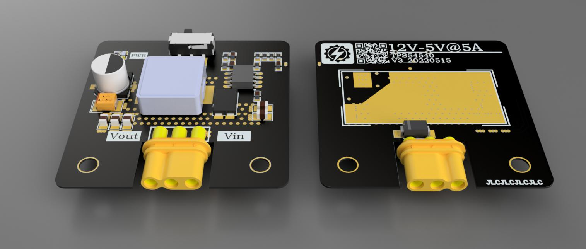

## **注意：本项目长期施工，目前没有成型的进展**

---
## **霜华**
- 霜华是一系列DCDC开关电源，包含控制器与转换器、Buck与Boost拓扑结构等多维选择。旨在为小型电控设备打造强力可靠的供电
- 市面上常见稳压模块由于过分节约成本与体积，存在诸多不合理的元件选型与布局，霜华将在适当增加元件用料与布局面积，达到合理的性能与稳定的散热。
---
## **性能**
#### 对于所有的霜华电源，发布前将包含以下测试指标，以保证最合理的容值阻值搭配
- **输出精度**：空载、满载时误差小于1%
- **输出电流**：无散热最大稳定电流、散热最大稳定电流
- **输出纹波**：空载、低负载(理论最大输出的5%)、中负载(理论最大输出的50%)、高负载(理论最大输出的90%)均小于1%、动态负载小于10%
- **效率**：全程在70%以上
- **价格**：单片标准体不超过市面同性能价格的150%，且元件均可在淘宝大型电子元器件店铺购买
#### 测试详情请见霜华电源测试规范
---
## **结构**
#### 对于霜华电源，使用通用Layout规范，每版均含有以下结构：
- 40mm*40mm的外形，具有两个M3固定孔
- 使用MR30接口的15A结构电流极限
- EN接口开关、TVS二极管、电源灯、输出滤波电容预留位等丰富拓展
- 散热开窗区
- 丰富且实用的丝印
#### 测试详情请见霜华电源布局规范
#### 此外，计划中还有“霜华S”布局(优秀性能，极小体积)与“霜华X”布局(较大体积，极致性能)，不考虑在规范内。霜华电源不会因为体积与成本大幅牺牲性能

---
## **资源目录**
#### 🟩已成型，极少再有版本更迭
#### 🟧落地中，短时间内微调较多
#### 🟦计划中，距离调试发布有一定距离
#### 🟥已弃用，因为一定原因终止开发

<h2>12V输入 </h2>

|   	    |1A 	    |3A         |5A         |5A+        |
|:---:      |:---:	    |:---:	    |:---:	    |:---:	    |
|正压|————————|————————|————————|————————|
| +3.3V     |   	    |   	    |   	    |   	    |
| +5.0V     |   	    |🟧TPS5430 🟥LM2596|🟧TPS54540|🟧LM3150   	    |
| +8.0V     |   	    |🟦TPS5430   	    |   	    |   	    |
| +ADJ      |   	    |🟦TPS5430 🟦LM2596|   	    |   	    |
|负压|————————|————————|————————|————————|
| -5.0V     |   	    |🟧TPS5430   	    |   	    |   	    |
| -ADJ      |   	    |🟦TPS5430   	    |   	    |   	    |
|升压|————————|————————|———————— |————————|
| 24V       |   	    |🟦LM2587  	    |   	    |   	    |
| ↑ADJ      |   	    |🟦LM2587  	    |   	    |   	    |

<h2>24V输入 </h2>

|   	|1A 	    |3A         |5A         |5A+        |
|:---:	|:---:	    |:---:	    |:---:	    |:---:	    |
| 正压  |————————   	    |————————   	    |————————   	    |————————   	    |
| +3.3V |   	    |🟦TPS54360    	    |   	    |   	    |
| +5.0V |   	    |🟦TPS54360    	    |🟦TPS54540           |   	    |
| +8.0V |   	    |🟦TPS54360    	    |   	    |   	    |
| +12.0V|   	    |🟦TPS54360    	    |   	    |   	    |
| +ADJ  |   	    |🟦TPS54360    	    |   	    |   	    |
| 负压  |————————   	    |————————   	    |———————— |————————|  
| -5.0V |   	    |   	    |   	    |   	    |
| -ADJ  |   	    |   	    |   	    |   	    |

---
## **常见问题**

---
## **设计资源**
#### 软件资源
- 电源设计：[WEBENCH]("https://www.ti.com.cn/zh-cn/design-resources/design-tools-simulation/webench-power-designer.html")
- PCB设计：[Altium Designer]("https://www.altium.com.cn/altium-designer/")
#### 硬件资源
- 示波器：
- 电源：
- 电子负载：[普源DL3000]("https://rigol.com/products/DL_Detail/DL3000")
---
